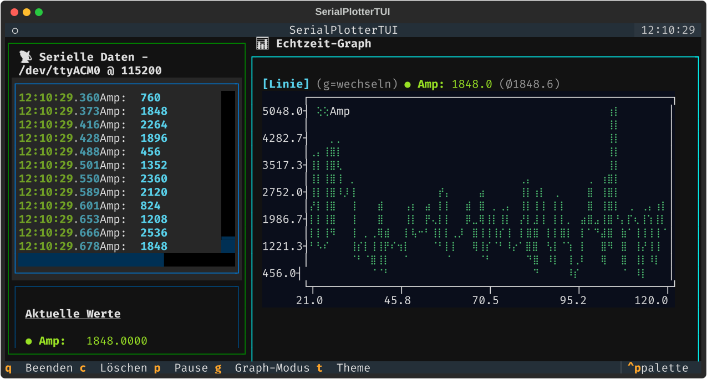

# SerialPlotterTUI



```bash
Verfügbare serielle Ports:
--------------------------------------------------
  /dev/ttyS3
    Beschreibung: n/a

  /dev/ttyS2
    Beschreibung: n/a

  /dev/ttyS1
    Beschreibung: n/a

  /dev/ttyS0
    Beschreibung: n/a

  /dev/ttyACM0
    Beschreibung: Calliope mini V3 CMSIS-DAP - mbed Serial Port
    Hersteller: Arm


Tipp: Starte mit: python SerialPlotterTUI.py /dev/ttyACM0
      Oder im Browser: python SerialPlotterTUI.py /dev/ttyACM0 --serve
```
